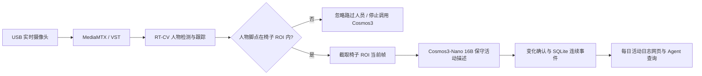

# DGX Spark 每日活动日志助手

这是一个基于 NVIDIA Video Search and Summarization（VSS）的自定义扩展，用 USB 实时摄像头按已登记人员记录一天中的可见活动。系统将连续观察合并成“10:15–10:40 在电脑前工作”这样的时间段，并允许通过网页或 VSS Agent 查询。

> 本扩展不是 NVIDIA 官方产品。仓库保留 NVIDIA VSS 的原始代码、历史、许可证和下方的官方项目说明；自定义功能集中在 `office-assistant` 目录、配置和部署脚本中。

## 工作方式



RT-CV 持续判断画面内是否有人。Office API 对已登记人员默认每 10 秒轮询一次可见活动，并保留原有单工位 20 秒采样；人在离座缓冲期内不会继续调用模型。

## 当前功能

- 单摄像头、单椅子 ROI 匿名分析。
- 当前在座状态、连续在座时间和当前行为。
- 每日在座时长、专注时长、专注率、首次到岗和最后离岗。
- 电脑操作、阅读、书写、手机、交谈、休息和无法判断的行为时长。
- 按已识别人员生成带起止时间、保守描述、置信度和观察次数的连续活动事件。
- 按日期、人员和关键词浏览网页时间线，或让 Agent 查询和总结历史活动。
- 离座次数、离座总时长和超过 60 秒才生效的离座规则。
- 工作日下班后、周末和配置节假日的加班时长。
- 行为时间轴、历史日报、ROI Web 标定和事件片段。
- 摄像头、RT-CV、Cosmos3 健康状态和断流恢复。
- 事件片段保留 7 天，日报数据保留 365 天。
- 内网 HTTPS 页面，无登录密码。

行为分类是视觉模型估计，仅适合个人时间复盘，不应作为员工绩效、考勤处罚或身份判断依据。摄像头、RT-CV 或模型不可用的时间标记为数据缺失，不计入有效在座和专注时长。

## 环境要求

- NVIDIA DGX Spark，DGX OS 7.4 或兼容版本。
- NVIDIA 驱动、CUDA 13、NVIDIA Container Toolkit。
- Docker Engine 28.3.3 以上且低于 29.5.0，Docker Compose 2.39.1 以上。
- `git-lfs`、`curl`、`ngc`、`v4l2-ctl` 和 Python 3。
- 支持 1080p MJPEG 或 raw 输出的 USB 摄像头。
- 有效的 NGC API key；Hugging Face token 可配置在 Spark 本地 `.env`。
- Cosmos3-Nano 权重约 32.6 GiB，首次下载建议预留至少 40 GiB。

## 首次部署

所有密钥、密码、模型权重、录像、数据库和实际配置都保存在 Spark 本地，不应提交到 GitHub。

```bash
git clone git@github.com:sadads435r/-vss-.git
cd ./-vss-

cp .env.example .env
cp config/office-config.example.yaml config/office-config.yaml
```

编辑 `.env`，至少填写：

```dotenv
NGC_CLI_API_KEY=你的_NGC_KEY
HF_TOKEN=你的_Hugging_Face_TOKEN
CAMERA_DEVICE=/dev/video0

COSMOS3_MODEL_REPO=nvidia/Cosmos3-Nano
COSMOS3_MODEL_REVISION=411f42a8fdfb8c5b2583cb8786e0938f49796eaa
COSMOS3_MODEL_DIR=/home/shiyiming/models/Cosmos3-Nano
COSMOS3_API_PORT=8018
COSMOS3_IMAGE=vss-office-cosmos3-nano:26.07
COSMOS3_AUTO_DOWNLOAD=true
```

如果 Spark 用户名不是 `shiyiming`，必须把 `COSMOS3_MODEL_DIR` 改成自己的绝对路径。然后执行：

```bash
./scripts/preflight.sh
./scripts/install.sh
./scripts/smoke-test.sh
./scripts/status.sh
```

安装脚本会下载权重、启动 VSS、USB 摄像头网关、Cosmos3 服务和 Office API，并尝试把 `office-main` 自动注册到 RT-CV。权重保存在 `COSMOS3_MODEL_DIR`，停止或重建容器不会重新下载。

## 已有 Spark 安装更新

先备份不受 Git 管理的本地配置：

```bash
cd "$HOME/-vss-"
cp -p .env "$HOME/vss-office.env.backup"
cp -p config/office-config.yaml "$HOME/vss-office-config.yaml.backup"

git fetch origin
git switch main
git pull --ff-only origin main

cp -p "$HOME/vss-office.env.backup" .env
cp -p "$HOME/vss-office-config.yaml.backup" config/office-config.yaml
./scripts/install.sh
./scripts/smoke-test.sh
```

如果部署的是版本标签，将 `git switch main` 和 `git pull` 换成：

```bash
git fetch --tags origin
git checkout office-assistant-v0.2.0
```

## 使用与配置

默认网页地址：

```text
https://<DGX_SPARK_IP>:8443/office
```

第一次打开后，展开“人员与摄像头设置”，获取摄像头当前帧，只框住椅面和正常坐姿区域并保存 ROI。工作时间、节假日、按人采样间隔、活动置信度、状态确认次数、离座阈值和留存时间位于：

```text
config/office-config.yaml
```

常用检查命令：

```bash
./scripts/status.sh
docker logs --tail 200 office-api
docker logs --tail 200 office-cosmos3-nano
curl http://127.0.0.1:8018/health
curl http://127.0.0.1:8090/api/workstation/live
```

如果 RT-CV 没有自动接入摄像头：

```bash
bash ./scripts/register-workstation-stream.sh
docker compose \
  --env-file .env \
  -f deploy/docker/developer-profiles/office-assistant/compose.yml \
  restart office-api
```

停止服务但保留权重、配置和历史数据：

```bash
./scripts/uninstall.sh
```

重新启动：

```bash
./scripts/install.sh
```

## 接口

| 接口 | 说明 |
|---|---|
| `GET /office-api/api/activity/events?date=&person_id=&q=` | 按日期、人员和关键词查询活动事件与统计 |
| `GET /office-api/api/activity/events?start=&end=` | 按 ISO 日期或时间范围查询活动事件 |
| `GET /office-api/api/person/activity/today` | 当前人数及今日按人活动概况 |
| `GET /office-api/api/people` | 已登记人员列表 |
| `GET /office-api/api/workstation/live` | 当前在座、行为、连续时长和健康状态 |
| `GET /office-api/api/workstation/reports?start=&end=` | 日期范围日报 |
| `GET /office-api/api/workstation/reports/{date}` | 某日统计、时间轴和离座记录 |
| `GET /office-api/api/workstation/frame` | ROI 标定当前帧 |
| `GET /office-api/api/workstation/roi` | 读取椅子 ROI |
| `PUT /office-api/api/workstation/roi` | 保存归一化椅子多边形 |

## 安全与隐私

- Web 入口没有密码，只能开放在受信任办公内网，禁止直接暴露到公网。
- Cosmos3、Office API、VST、RT-CV、Kafka 和 Elasticsearch 端口不应向不受信任网络开放。
- Caddy 默认签发本地 CA 证书；客户端需要信任 Caddy 根证书，或改用组织签发的证书。
- 人员参考截图和活动数据库仅保存在本机数据目录；人员名称由管理员在内网页面维护。
- 模型只允许描述画面可见动作，不读取或猜测屏幕内容、文件名、项目、会议主题或业务目的。

更完整的配置、发布和回滚说明见 [办公助手部署文档](docs/OFFICE_ASSISTANT.md)。

---

## 上游 NVIDIA VSS 项目说明

以下内容保留自 NVIDIA VSS 上游项目。

<h2>NVIDIA AI Blueprint: Video Search and Summarization (VSS)</h2>

**Build GPU-accelerated video AI agents that search, analyze, summarize, and reason over live or recorded video using natural language.**

NVIDIA AI Blueprint for Video Search and Summarization (VSS) combines vision-language models, RAG, and NVIDIA NIM microservices to deliver real-time video analytics, visual Q&A, alert verification, clip retrieval, and long-video summarization.

- Search video streams or archives using natural language queries
- Summarize hours of video
- Ask visual questions and automatically generate reports
- Detect and verify real-time alerts with VLMs

**[🚀 Try the Demo](https://build.nvidia.com/nvidia/video-search-and-summarization)** · **[⚡ Quickstart](#quickstart-guide)** · **[📚 Documentation](https://docs.nvidia.com/vss/latest/index.html)** · **[🏗️ Architecture](#software-components)** · **[📦 Latest Release](https://github.com/NVIDIA-AI-Blueprints/video-search-and-summarization/releases/latest)**

### Table of Contents
- [Overview](#overview)
- [Use Case / Problem Description](#use-case--problem-description)
- [Agent Workflows](#agent-workflows)
- [Software Components](#software-components)
- [Target Audience](#target-audience)
- [Repository Structure Overview](#repository-structure-overview)
- [Documentation](#documentation)
- [Prerequisites](#prerequisites)
- [Hardware Requirements](#hardware-requirements)
- [Quickstart Guide](#quickstart-guide)
- [Contributing](#contributing)
- [License](#license)

## Overview

The [NVIDIA Blueprint for Video Search and Summarization (VSS)](https://docs.nvidia.com/vss/latest/index.html) provides a suite of reference architectures for building vision agents and AI-powered video analytics applications. Those architectures bring together accelerated vision microservices, vision language models (VLMs), and large language models (LLMs) so you can use them in existing applications, as standalone microservices, or as part of a larger vision agent.

VSS is organized into three areas of processing and analysis: **real-time video intelligence** (feature extraction, embeddings, and stream understanding with results published to a message broker), **downstream analytics** (enrichment of metadata into trajectories, incidents, and verified alerts), and **agentic and offline processing** (orchestrated tools for search, Q&A, summarization, and clip retrieval, including via the Model Context Protocol).

This repository implements the blueprint and powers the [NVIDIA build experience](https://build.nvidia.com/nvidia/video-search-and-summarization) for natural-language video agents—search, summarization, visual Q&A, and related workflows—backed by generative AI, VLMs and LLMs, and [NVIDIA NIM](https://build.nvidia.com/) microservices as configured in the stacks below.

## Use Case / Problem Description

The NVIDIA AI Blueprint for Video Search and Summarization addresses the challenge of deploying visual agents capable of interacting with large volumes of video data, both stored and streamed. This can be used to create vision AI agents, that can be applied to a multitude of use cases such as monitoring smart spaces, warehouse automation, and SOP validation. This is important where quick and accurate video analysis can lead to better decision-making and enhanced operational efficiency.

## Agent Workflows
We provide multiple reference [Agent Workflows](https://docs.nvidia.com/vss/latest/agent-workflows.html) which demonstrate how the individual components can be leveraged by an agent:

| Workflow | Description |
|----------|-------------|
| [Q&A and Report Generation (Quickstart)](https://docs.nvidia.com/vss/latest/quickstart.html) | Video retrieval, VLM-based Q&A, and report generation on short video clips |
| [Alert Verification](https://docs.nvidia.com/vss/latest/agent-workflow-alert-verification.html) | Realtime processing of videos using perception (object detection, tracking) and behavior analytics to generate alerts, which are subsequently verified with VLM to reduce false positives |
| [Real-Time Alerts](https://docs.nvidia.com/vss/latest/agent-workflow-rt-alert.html) | Continuous processing of video streams through VLM for anomaly detection |
| [Video Search](https://docs.nvidia.com/vss/latest/agent-workflow-search.html) | Natural language search across video archives using video embeddings (alpha) |
| [Long Video Summarization](https://docs.nvidia.com/vss/latest/agent-workflow-lvs.html) | Analysis and summarization of extended video recordings through chunking and aggregation of dense captions |

## Software Components
<div align="center">
  
</div>

1. **NIM microservices**: Here are models used in this blueprint:

    - [Cosmos3 Nano Reasoner](https://build.nvidia.com/nvidia/cosmos3-nano-reasoner)
    - [NVIDIA Nemotron-Nano-9B-v2](https://build.nvidia.com/nvidia/nvidia-nemotron-nano-9b-v2)

2. **Real-time video intelligence**: The Real-Time Video Intelligence layer extracts rich visual features, semantic embeddings, and contextual understanding from video data in real-time, publishing results to a message broker for downstream analytics and agentic workflows. It provides three core microservices for processing video streams.

3. **Downstream analytics**: The Downstream Analytics layer processes and enriches the metadata streams generated by real-time video intelligence microservices, transforming raw detections into actionable insights and verified alerts.

4. **Agent and offline processing**: The top-level agent leverages the Model Context Protocol (MCP) to access video analytics data, incident records, and vision processing capabilities through a unified tool interface. It integrates multiple vision-based tools including video understanding with Vision Language Models (VLMs), semantic video search using embeddings, long video summarization for extended footage analysis, and video snapshot/clip retrieval.

## Target Audience
This blueprint is designed for ease of setup with extensive configuration options, requiring technical expertise. It is intended for:

1. **Video Analysts and IT Engineers:** Professionals focused on analyzing video data and ensuring efficient processing and summarization. The blueprint offers 1-click deployment steps, easy-to-manage configurations, and plug-and-play models, making it accessible for early developers.

2. **GenAI Developers / Machine Learning Engineers:** Experts who need to customize the blueprint for specific use cases. This includes modifying the pipelines for unique datasets and fine-tuning LLMs as needed. For advanced users, the blueprint provides detailed configuration options and custom deployment possibilities, enabling extensive customization and optimization.

## Repository Structure Overview

| Directory | Description |
|-----------|-------------|
| `services/agent/` | Video search and summarization agent (Python). Contains `src/vss_agents/` (tools, agents, APIs, embeddings, evaluators, video analytics), `tests/`, `stubs/`, `docker/`, and `3rdparty/`. See [services/agent/README.md](services/agent/README.md). |
| `services/ui/` | Frontend monorepo (Next.js, Turbo): `apps/` (nemo-agent-toolkit-ui, nv-metropolis-bp-vss-ui) and shared `packages/`. See [services/ui/README.md](services/ui/README.md). |
| `services/analytics/` | Downstream analytics services for processing real-time video intelligence metadata. Contains behavior analytics stream processing and REST APIs for querying analytics results. |
| `services/analytics/behavior-analytics/` | Python streaming pipeline for spatial AI analytics, incident detection, Smart City, warehouse, playback, and other behavior analytics applications. Includes app entry points, configs, Docker support, tests, and detailed guides. See [services/analytics/behavior-analytics/README.md](services/analytics/behavior-analytics/README.md). |
| `services/analytics/video-analytics-api/` | Node.js and Express REST API service for VSS Video Analytics data. Exposes metrics, tracker, frames, behavior, clustering, events, sensor, config, alerts, and incidents endpoints backed by Elasticsearch. See [services/analytics/video-analytics-api/README.md](services/analytics/video-analytics-api/README.md). |
| `deploy/` | Deployment configs, Docker Compose, and Helm charts: NIM model configs, developer profiles (dev-profile-base, dev-profile-search, dev-profile-alerts, dev-profile-lvs), foundational services, LVS, RTVI, VLM-as-verifier, VST, and root `compose.yml`. Also contains `deploy/docker/scripts/` — the Brev launchable notebook and dev-profile / patch scripts. |
| `tools/message-broker-consumers/` | Multiprocessing Redis and Kafka consumers that decode VSS protobuf messages from streams/topics and export them as JSON Lines files for inspection, debugging, or offline processing. See [tools/message-broker-consumers/README.md](tools/message-broker-consumers/README.md). |
| `tools/sdg-postprocessing/` | Dataset post-processing utilities for synthetic data generation workflows: semantic labeling helpers, raw data sanity checks, RGB/depth/video conversion, and ground-truth conversion for MTMC-compatible datasets. See [tools/sdg-postprocessing/README.md](tools/sdg-postprocessing/README.md). |
| `tools/rtvi-cv-mv3dt-utils/` | Offline utilities for generating MV3DT RTVI-CV configuration artifacts, including per-camera `camInfo` projection configs and MQTT publish/subscribe topology files for warehouse MV3DT deployments. See [tools/rtvi-cv-mv3dt-utils/README.md](tools/rtvi-cv-mv3dt-utils/README.md). |
| `skills/` | [agentskills.io](https://agentskills.io/specification)-compatible agent skills for VSS: one self-contained subdirectory per skill with `SKILL.md` frontmatter. Covers deploy and usage of search, summarization, alerts, VIOS, RT-VLM, LVS, and other related workflows—see the catalog and install notes in [skills/README.md](skills/README.md). |
| `libs/analytics/spatialai-data-utils/` | Spatial AI Data Utils (SDU): NVSchema / ground-truth / calibration / Sparse4D loaders, camera calibration + grouping (BEV group-origin / per-group fan-out), 3D&#x2194;2D geometry, multi-cam 3D-bbox visualization, detection (mAP) + tracking (HOTA, CLEAR, identity, count) evaluators, NVSchema result converters, and video&#x2194;frame utilities. See [libs/analytics/spatialai-data-utils/README.md](libs/analytics/spatialai-data-utils/README.md). |

## Documentation

For detailed instructions and additional information about this blueprint, please refer to the [official documentation](https://docs.nvidia.com/vss/latest/index.html).

## Prerequisites

### Obtain API Key

- NVIDIA AI Enterprise developer licence required to local host NVIDIA NIM.
- API catalog keys:
   - NVIDIA [API catalog](https://build.nvidia.com/) or [NGC](https://org.ngc.nvidia.com/setup/api-keys) ([steps to generate key](https://docs.nvidia.com/ngc/gpu-cloud/ngc-user-guide/index.html#generating-api-key))

## Hardware Requirements

The platform requirement can vary depending on the configuration and deployment topology used for VSS and dependencies like VLM, LLM, etc. For a list of validated GPU topologies and what configuration to use, see the [GPU requirements](https://docs.nvidia.com/vss/latest/prerequisites.html#development-profile-gpu-requirements).

## Quickstart Guide

### Launchable Deployment

**Ideal for:** Quickly getting started with your own videos without worrying about hardware and software requirements.

Follow the steps from the [documentation](https://docs.nvidia.com/vss/latest/cloud-brev.html) and notebook in [deploy/docker/scripts](deploy/docker/scripts/) directory to complete all pre-requisites and deploy the blueprint using Brev Launchable in a 2xRTX PRO 6000 SE AWS instance.
- [deploy/docker/scripts/deploy_vss_launchable.ipynb](deploy/docker/scripts/deploy_vss_launchable.ipynb): This notebook is tailored specifically for the AWS CSP which uses Ephemeral storage.

### Docker Compose Deployment

**Ideal for:** Deploying a VSS agent on your own hardware or bare metal cloud instance.

#### System Requirements

- OS:
    - x86 hosts: Ubuntu 22.04 or Ubuntu 24.04
    - DGX-SPARK: DGX OS 7.4.0
    - IGX-THOR: Jetson Linux BSP (Rel 38.5)
    - AGX-THOR: Jetson Linux BSP (Rel 38.4)
- NVIDIA Driver:
    - 580.105.08 (x86 hosts with Ubuntu 24.04)
    - 580.65.06 (x86 hosts with Ubuntu 22.04)
    - 580.95.05 (DGX-SPARK)
    - 580.00 (IGX-THOR and AGX-THOR)
- NVIDIA Container Toolkit: 1.17.8+
- Docker Engine: 28.3.3 <= Docker Engine < 29.5.0
- Docker Compose: v2.39.1+
- NGC CLI: 4.10.0+

> **Docker upper bound:** Docker Engine 29.5.0+ may fail pulling NGC-hosted images. Use Docker Engine 28.3.3 or another supported version below 29.5.0.

Please refer to [Prerequisites section here for installation details](https://docs.nvidia.com/vss/latest/prerequisites.html).


## Contributing
See [CONTRIBUTING.md](CONTRIBUTING.md) for the development workflow, branch naming convention, and PR guidelines.


## License
Refer to [LICENSE](LICENSE)
