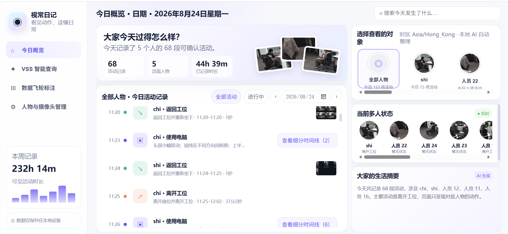
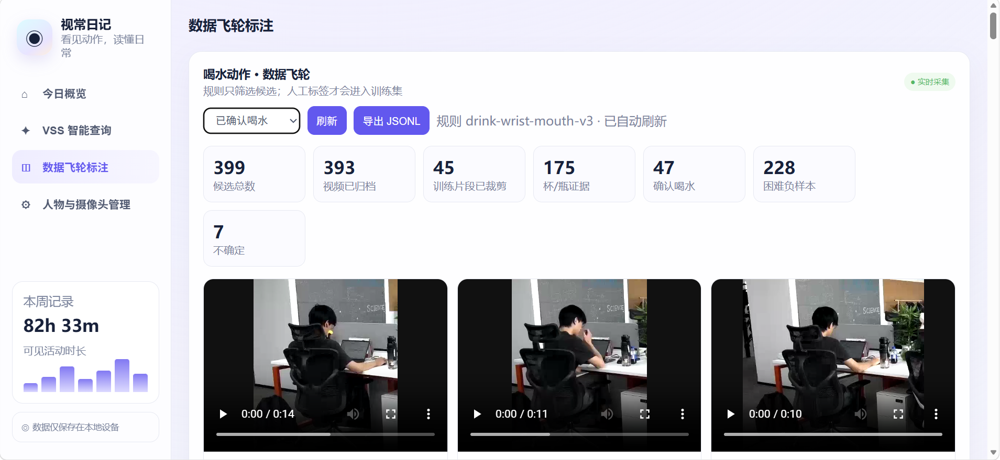
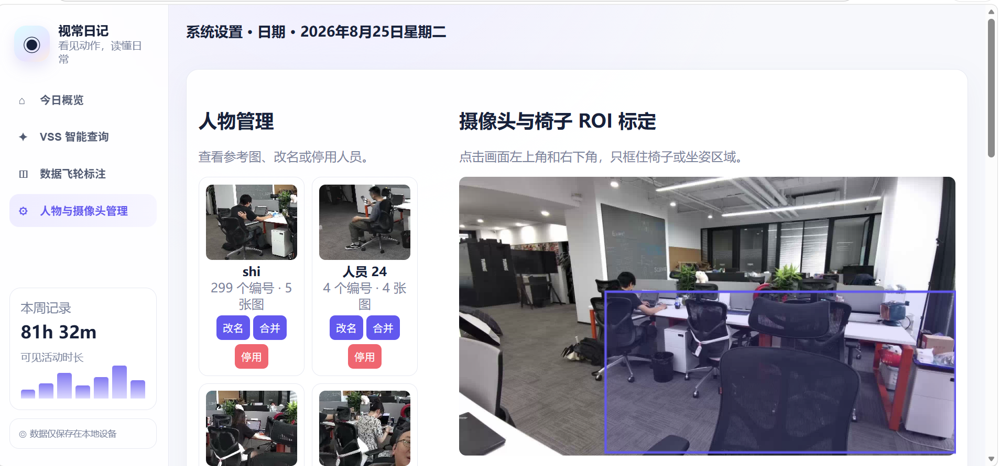

# 视觉日记：办公室多模态行为分析与数据飞轮

“视觉日记”是基于 NVIDIA VSS、DeepStream、GDINO、NvDCF/ReID、MediaPipe 和 Cosmos3 构建的多人办公室行为分析系统。它将摄像头中的连续视频整理成按人物、日期和时间排列的活动记录，并提供自然语言查询、人物库管理、工位 ROI 标定、事件视频复核、人工标注、数据增强及 Cosmos3 LoRA 微调能力。

项目重点不是监控屏幕内容或推测人的意图，而是根据可见证据回答三个问题：画面里是谁、这个人在做什么、这段行为在一天中持续了多久。

## 1. 项目目标

- 把实时视频转化为可检索、可解释的个人活动时间线。
- 将同一人物跨短 tracker 的记录通过 ReID、位置和时间证据关联起来。
- 合并连续且语义相同的事件，避免把“观看电脑、键盘输入、鼠标操作、坐在电脑前”拆成大量碎片。
- 显式记录离开工位和返回工位，补全事件之间的空白时段。
- 通过姿态、目标物和时序规则生成候选，再让 VLM 与人工复核，降低单一模型误判。
- 把人工确认结果回流为训练集，形成“采集—标注—训练—评估—再采集”的数据飞轮。

## 2. 系统界面

### 今日概览与人物时间线



首页在一屏内展示当天人物数、活动数、累计记录时长和人物活动时间线。用户可以按日期、人物和活动状态筛选；同类连续事件会合并为一个时间段，点击“查看细分时间线”可查看其原始子事件和证据图。

页面只描述当前人物本身的可见动作，不把背景、办公室环境或其他人的动作混入描述。人物身份不确定时显示临时编号，确认后可在人物库中重命名或合并。

### 数据飞轮标注



数据飞轮页集中展示候选总数、归档视频数、已裁剪训练片段、杯/瓶目标证据、确认正样本、困难负样本和不确定样本。候选视频可以在线播放、人工修改起止时间并标注为：

- 确认喝水：动作完整且证据充分的正样本。
- 困难负样本：手接近口部、拿杯但未饮用等容易误报的片段。
- 不确定：遮挡、画面边缘、动作不完整或证据不足的片段。

只有人工确认的数据才进入训练集；规则命中本身不等于真实标签。

### 人物与摄像头管理



管理页提供人物参考图、改名、停用和手动合并功能。系统为每个人保留少量高质量参考图，合并后其历史事件和参考图会归入同一人物档案。

摄像头画面支持交互式椅子 ROI 标定。ROI 只框住椅面与正常坐姿区域，用于判断在座、离开工位和返回工位；它不参与身份认证，也不会被解释为真实世界距离。

## 3. 核心功能

### 3.1 多人检测、跟踪与人物库

- GDINO/RT-CV 检测人物以及杯子、瓶子等行为相关物体。
- NvDCF 提供短时目标跟踪，ReID 特征用于跨 tracker 召回人物候选。
- 身份关联同时参考外观、时间连续性、工位位置和人物库参考图，不直接把 tracker ID 当作人物 ID。
- 支持人工重命名、停用误检人物，以及把同一人的多个临时档案手动合并。
- 匹配证据不足时保留为“待确认人员”，优先避免错误合并。

### 3.2 独立 MediaPipe 姿态数据流

项目没有继续把事件生成绑定在 NvDCF `Object.pose` 上。MediaPipe 从人物框中提取身体与手部关键点，发布到独立的 `mdx-office-pose` 数据流；原始检测和跟踪数据继续保留在 `mdx-raw`。

姿态流包含时间戳、sensor ID、tracker ID、人物框、身体关键点、手部关键点及可见度。行为分析端按 sensor、tracker 和时间窗口将其与检测、ReID、ROI 和目标物证据融合。这样即使 DeepStream 内部 PoseEstimator 没有附着关节，活动链路仍能工作。

### 3.3 连续活动时间线

系统将模型产生的细粒度动作归一为较稳定的活动类别，例如：

- 使用电脑：观看屏幕、键盘输入、鼠标或触控板操作。
- 阅读或书写。
- 使用手机。
- 交谈。
- 吃东西或喝水。
- 离开工位、返回工位。
- 休息或其他无法可靠细分的动作。

相邻窗口如果人物一致、活动类别一致且间隔在容忍范围内，会合并为一个持续事件。短 tracker 切换不会立即打断事件；系统先尝试通过人物身份、空间重叠和时间连续性重连。离开 ROI 后产生“离开工位”，重新进入并稳定坐下后产生“返回工位”，从而解释记录中的长时间空白。

### 3.4 多级行为判定

行为判定采用逐级收敛的方式：

1. 规则层根据姿态距离、关节速度、连续帧、ROI 状态和目标物置信度筛选候选。
2. 事件层把候选前后帧合并并裁剪为人物级视频片段。
3. Cosmos3 根据片段判断动作是否成立，并输出结构化类别、置信度、动作证据和拒绝原因。
4. 人工复核修正标签和视频边界，最终决定是否进入训练集。

以喝水为例，手腕靠近嘴部只是召回条件之一，还可结合杯/瓶目标框、手部运动轨迹、动作持续时间和“靠近—停留—离开”的时序模式。规则用于提高召回，VLM 和人工标注用于提高精度。

### 3.5 VSS 智能查询

侧栏中的 VSS 智能查询可以用自然语言检索人物、日期、活动类型和事件证据，例如：

- “shi 今天什么时候离开过工位？”
- “下午有哪些持续超过十分钟的电脑活动？”
- “为什么这段视频被判断为喝水候选？”

Agent 先调用活动查询接口获取事件列表，再根据 `event_id` 读取动作描述、时间范围、人物、关键帧、目标物和姿态证据。回答以本地结构化记录为依据，不凭空推测屏幕内容、谈话主题或人的心理状态。

### 3.6 数据飞轮与人工标注

候选生成器持续从姿态和物体证据中采样，但不会保存所有视频。只有满足召回规则、位于有效人物框、具备足够时长和画质的窗口才会归档。候选去重后进入人工标注页，并支持二次裁剪。

标注结果可导出为 JSONL，记录原始事件、人物、视频路径、标签、裁剪边界、规则版本、物体证据和是否为增强样本。训练集、验证集和测试集按原始事件分组，确保同一视频的裁剪版或增强版不会泄漏到不同数据集。

## 4. 数据增强与 Cosmos3 LoRA

训练工具位于 `tools/office-assistant-lora/`。当前流程将较长候选片段裁成约 4–5 秒的动作中心窗口，并抽取 4–5 帧作为视频模型输入。训练集可进行轻度亮度、对比度、噪声和水平翻转增强；增强样本标记 `is_augmented=true`、训练时降权，且增强数据占训练集不超过 30%。验证集和测试集不做增强。

已完成的实验采用 Cosmos3-Nano Reasoner BF16 LoRA SFT：

- 训练数据：45 条人工确认喝水正样本、90 条困难负样本和 32 条轻度增强样本，共 167 条。
- LoRA Rank：16；可训练参数约 43.6M。
- 训练过程：50 个优化步、400 个微步。
- NVIDIA GB10 峰值显存：17.51 GiB。
- 扩展盲测：137 条片段，其中 5 条正样本、132 条未参与训练的负样本。

| 指标 | Base | LoRA |
| --- | ---: | ---: |
| 误报数 | 17 | 6 |
| 负样本误报率 | 12.9% | 4.5% |
| Precision | 22.7% | 45.5% |
| Recall | 100% | 100% |
| F1 | 0.370 | 0.625 |
| JSON 结构合规率 | 0% | 100% |

LoRA 将误报相对降低 64.7%，但测试集中只有 5 条独立正样本，因此 100% Recall 不能视为生产结论。下一轮应继续采集训练后产生的新正样本，并优先复核剩余误报作为 hard negative。

## 5. 系统架构

```text
USB/RTSP 摄像头
  ├─ Camera Gateway / MediaMTX / VST
  ├─ DeepStream RT-CV → 人物框、tracker、ReID → mdx-raw
  ├─ GDINO → 人物、杯子、瓶子等目标物证据
  └─ MediaPipe Pose Collector → 身体/手部关键点 → mdx-office-pose
                                      │
                                      ▼
                       Behavior / Flywheel Worker
                姿态规则 + ROI + 时序 + 身份 + 目标物融合
                         │                    │
                         ▼                    ▼
                活动事件与个人时间线      候选视频裁剪
                         │                    │
                         ▼                    ▼
                   Office API / UI      Cosmos3 二次判断
                                              │
                                              ▼
                                  人工标注 → SFT 数据集
                                              │
                                              ▼
                                   BF16 LoRA → 成对评估
```

## 6. 与标准 VSS Behavior Analytics 的区别

标准 VSS Behavior Analytics 更偏向预定义场景中的通用检测、规则事件和告警。本项目面向办公室个人日常，增加了人物级长期时间线、人物库与人工合并、椅子 ROI 的离开/返回闭环、MediaPipe 独立姿态流、杯/瓶目标证据、VLM 二次确认、事件视频裁剪和可训练数据飞轮。

系统不把一次检测直接当成最终事件，而是保留“检测证据—规则候选—VLM 判断—人工标签—模型迭代”的完整链路，因此更适合持续优化细粒度动作识别。

## 7. 仓库结构

```text
config/office-config.example.yaml
deploy/docker/developer-profiles/office-assistant/
  compose.yml
  camera-gateway/
  diagnostics/
  office-api/
    app.py                 # API 与页面入口
    workstation.py         # 人物、工位与活动时间线
    motion.py              # 动作窗口与归一化
    pose_collector.py      # MediaPipe 姿态采集
    flywheel.py            # 标注与数据飞轮接口
    flywheel_worker.py     # 候选生成与视频裁剪
    gdino_client.py        # 目标物检测客户端
    static/index.html      # 单页前端
docs/OFFICE_ASSISTANT.md
docs/OFFICE_ASSISTANT_ENGINEERING_NOTES.md
tools/office-assistant-lora/ # 数据集、训练、评估与审计工具
```

## 8. 部署前提

- DGX Spark / GB10 或兼容 NVIDIA GPU 环境。
- Docker 28.3.3+ 且低于 29.5.0、Docker Compose 2.39.1+。
- NVIDIA Container Toolkit 1.17.8+。
- `git-lfs`、`curl`、NGC CLI 和可用的 NVIDIA NGC 凭据。
- 支持 1920×1080 MJPEG 或 raw 输出的 USB 摄像头，或稳定 RTSP 视频源。
- Cosmos3-Nano、GDINO、MediaPipe 模型和 VSS 所需服务镜像。

GB10 使用统一内存。启动训练前应先检查系统内存和 GPU 占用，只暂停占用最大的 Cosmos/Nemotron 推理服务，并保持摄像头、Kafka、姿态采集和数据归档链路运行。恢复时先启动 Nemotron，健康后再启动 Cosmos，以避免 KV Cache 初始化失败。

## 9. 配置与启动

```bash
cp .env.example .env
cp config/office-config.example.yaml config/office-config.yaml

./scripts/preflight.sh
./scripts/install.sh
./scripts/smoke-test.sh
./scripts/status.sh
```

默认入口为 `https://<SPARK_IP>:8443/office`。现场配置和 RTSP 凭据只保存在 `.env` 与 `office-config.yaml` 中，不提交到 Git。

安装后需要完成以下初始化：

1. 确认摄像头画面和 `mdx-raw` 持续增长。
2. 确认 `mdx-office-pose` 能输出与人物框对应的姿态记录。
3. 在管理页框选椅子与正常坐姿 ROI。
4. 检查人物库参考图，合并明显属于同一人的临时档案。
5. 在数据飞轮页复核第一批候选，验证视频边界和标签流程。

## 10. API 与数据

- `GET /office-api/api/activity/events`：按日期、人物和类型查询活动。
- `GET /office-api/api/activity/events/{id}`：读取事件详情和判断证据。
- `GET /office-api/api/people/{id}/images`：读取人物参考图。
- 数据飞轮接口：候选筛选、视频播放、人工标签、二次裁剪和 JSONL 导出。
- 人物管理接口：改名、停用、合并和参考图管理。
- 摄像头接口：读取画面、保存 ROI 和检查实时状态。

活动事件与训练候选采用不同的数据表和保留周期。候选必须保留规则版本与原始事件关联，便于追溯模型为什么获得某个训练标签。

## 11. 隐私与使用边界

- 系统仅用于受控办公环境中的技术验证，不用于考勤处罚、身份认证、医疗判断或执法。
- 不识别屏幕文字，不推测文件内容、工作成果、情绪、健康状况或谈话主题。
- 人物库是视频内的身份关联工具，不是生物识别认证系统。
- 页面和 API 默认只应开放给可信内网，禁止直接暴露到公网。
- RTSP URL、密码、Token、视频、数据库、参考图、训练数据、模型权重与 LoRA Adapter 均不提交 Git。
- 人工复核是训练标签的最终来源；VLM 输出不能代替人工确认。

## 12. 当前限制与后续方向

- 短 tracker 和遮挡仍可能造成身份断裂，需要继续优化 ReID 阈值与时空关联。
- 离开/返回事件依赖正确 ROI，摄像头移动后必须重新标定。
- 喝水等短动作的正样本量仍小，应扩大不同人物、杯型、角度和光照条件下的独立测试集。
- Cosmos3 LoRA 已完成离线对照实验，尚需灰度接入生产推理服务并监控真实误报率。
- 未来可增加更多动作规则，如进食、打电话、伸展和跌倒，但每种动作都应独立定义候选证据、标注规范和无泄漏测试集。

更多排障过程、训练参数和简历素材见 [OFFICE_ASSISTANT_ENGINEERING_NOTES.md](OFFICE_ASSISTANT_ENGINEERING_NOTES.md)。
